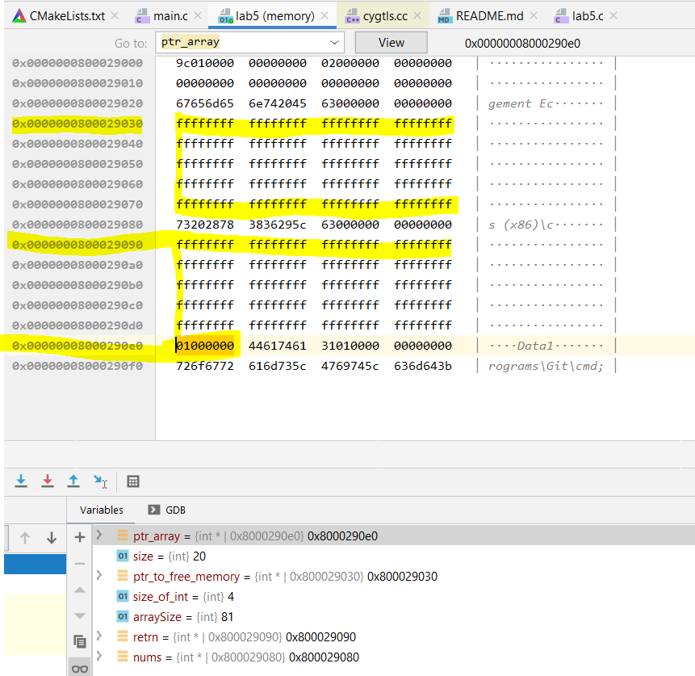

#### CS 120
# Lab 5 - Dynamic Memory

### [Assignment Description](https://docs.google.com/document/d/1dW8uLGfMZNsLcnMDfjjfecPSmJTKSz23oNRx4T0Q8iU/edit?usp=sharing)

***

_Replace anything surrounded by the `< >` symbols._

## SUMMARY:
 < The program runs a series of functions that get evaluated in the given code further in the program. Each of the functions rely on pointers to manipulate arrays.>

## GRACE DAYS
Grace days used for this assignment: < 0 >

Grace days remaining: < 5>/5

## KNOWN BUGS AND INCOMPLETE PARTS:
See miscellaneous comments.

## REFERENCES:
 Geeksforgeeks.org

## MISCELLANEOUS COMMENTS:
 I had some trouble with valgrind, but everything is actually right.
 See the valgrind error where it says "invalide write of size 4".
 That is actually a valid write and has been checked in the memory information of CLion.
 Please see attached screenshot.
 
 * 
 ```
        -----------------------------------
        -           Dynamic Arrays        -
        -----------------------------------
        ========= After each test you should print our your array using a loop ===========
        ========= All loops should ONLY use pointer arithmetic to iterate ===========


        =========Test #1: Create an integer array of size ===========
        == Write a function that returns an integer array of INIT_SIZE elements all containing -1 ==

-1-1-1-1-1-1-1-1-1-1-1-1-1-1-1-1-1-1-1-1

        =========Test #2: 'Grow' the array by 1, and insert the value 1 at the end ===========

==2049665== Invalid write of size 4
==2049665==    at 0x1092B3: test2 (lab5.c:76)
==2049665==    by 0x109622: main (lab5.c:226)
==2049665==  Address 0x4a40560 is 80 bytes inside a block of size 81 alloc'd
==2049665==    at 0x483577F: malloc (vg_replace_malloc.c:299)
==2049665==    by 0x109256: test2 (lab5.c:56)
==2049665==    by 0x109622: main (lab5.c:226)
==2049665==
==2049665== Conditional jump or move depends on uninitialised value(s)
==2049665==    at 0x48CD029: vfprintf (vfprintf.c:1637)
==2049665==    by 0x48D4605: printf (printf.c:33)
==2049665==    by 0x1092D1: test2 (lab5.c:77)
==2049665==    by 0x109622: main (lab5.c:226)
==2049665==
==2049665== Use of uninitialised value of size 8
==2049665==    at 0x48C8D1E: _itoa_word (_itoa.c:179)
==2049665==    by 0x48CC5F3: vfprintf (vfprintf.c:1637)
==2049665==    by 0x48D4605: printf (printf.c:33)
==2049665==    by 0x1092D1: test2 (lab5.c:77)
==2049665==    by 0x109622: main (lab5.c:226)
==2049665==
==2049665== Conditional jump or move depends on uninitialised value(s)
==2049665==    at 0x48C8D29: _itoa_word (_itoa.c:179)
==2049665==    by 0x48CC5F3: vfprintf (vfprintf.c:1637)
==2049665==    by 0x48D4605: printf (printf.c:33)
==2049665==    by 0x1092D1: test2 (lab5.c:77)
==2049665==    by 0x109622: main (lab5.c:226)
==2049665==
==2049665== Conditional jump or move depends on uninitialised value(s)
==2049665==    at 0x48CD213: vfprintf (vfprintf.c:1637)
==2049665==    by 0x48D4605: printf (printf.c:33)
==2049665==    by 0x1092D1: test2 (lab5.c:77)
==2049665==    by 0x109622: main (lab5.c:226)
==2049665==
==2049665== Conditional jump or move depends on uninitialised value(s)
==2049665==    at 0x48CC75D: vfprintf (vfprintf.c:1637)
==2049665==    by 0x48D4605: printf (printf.c:33)
==2049665==    by 0x1092D1: test2 (lab5.c:77)
==2049665==    by 0x109622: main (lab5.c:226)
==2049665==
-1-1-1-1-1-1-1-1-1-1-1-1-1-1-1-1-1-1-1-11
==2049665== Conditional jump or move depends on uninitialised value(s)
==2049665==    at 0x1096A0: main (lab5.c:232)
==2049665==

        =========Test #3: Double the size of the array ===========


        =========Test #3: Copy the values from the old array to the new array===========


        =========Test #3: Fill the remaining indexes in the new array with the first half values===========

==2049665== Conditional jump or move depends on uninitialised value(s)
==2049665==    at 0x48CD029: vfprintf (vfprintf.c:1637)
==2049665==    by 0x48D4605: printf (printf.c:33)
==2049665==    by 0x1093A1: test3 (lab5.c:117)
==2049665==    by 0x1096F5: main (lab5.c:239)
==2049665==
==2049665== Use of uninitialised value of size 8
==2049665==    at 0x48C8D1E: _itoa_word (_itoa.c:179)
==2049665==    by 0x48CC5F3: vfprintf (vfprintf.c:1637)
==2049665==    by 0x48D4605: printf (printf.c:33)
==2049665==    by 0x1093A1: test3 (lab5.c:117)
==2049665==    by 0x1096F5: main (lab5.c:239)
==2049665==
==2049665== Conditional jump or move depends on uninitialised value(s)
==2049665==    at 0x48C8D29: _itoa_word (_itoa.c:179)
==2049665==    by 0x48CC5F3: vfprintf (vfprintf.c:1637)
==2049665==    by 0x48D4605: printf (printf.c:33)
==2049665==    by 0x1093A1: test3 (lab5.c:117)
==2049665==    by 0x1096F5: main (lab5.c:239)
==2049665==
==2049665== Conditional jump or move depends on uninitialised value(s)
==2049665==    at 0x48CD213: vfprintf (vfprintf.c:1637)
==2049665==    by 0x48D4605: printf (printf.c:33)
==2049665==    by 0x1093A1: test3 (lab5.c:117)
==2049665==    by 0x1096F5: main (lab5.c:239)
==2049665==
==2049665== Conditional jump or move depends on uninitialised value(s)
==2049665==    at 0x48CC75D: vfprintf (vfprintf.c:1637)
==2049665==    by 0x48D4605: printf (printf.c:33)
==2049665==    by 0x1093A1: test3 (lab5.c:117)
==2049665==    by 0x1096F5: main (lab5.c:239)
==2049665==
-1-1-1-1-1-1-1-1-1-1-1-1-1-1-1-1-1-1-1-11-1-1-1-1-1-1-1-1-1-1-1-1-1-1-1-1-1-1-1-11
==2049665== Conditional jump or move depends on uninitialised value(s)
==2049665==    at 0x10975C: main (lab5.c:244)
==2049665==

        =========Test #4: Reduce the size of the array by half  ===========


        =========Test #4: Copy over the first half values ===========

==2049665== Conditional jump or move depends on uninitialised value(s)
==2049665==    at 0x48CD029: vfprintf (vfprintf.c:1637)
==2049665==    by 0x48D4605: printf (printf.c:33)
==2049665==    by 0x109448: test4 (lab5.c:150)
==2049665==    by 0x1097EE: main (lab5.c:253)
==2049665==
==2049665== Use of uninitialised value of size 8
==2049665==    at 0x48C8D1E: _itoa_word (_itoa.c:179)
==2049665==    by 0x48CC5F3: vfprintf (vfprintf.c:1637)
==2049665==    by 0x48D4605: printf (printf.c:33)
==2049665==    by 0x109448: test4 (lab5.c:150)
==2049665==    by 0x1097EE: main (lab5.c:253)
==2049665==
==2049665== Conditional jump or move depends on uninitialised value(s)
==2049665==    at 0x48C8D29: _itoa_word (_itoa.c:179)
==2049665==    by 0x48CC5F3: vfprintf (vfprintf.c:1637)
==2049665==    by 0x48D4605: printf (printf.c:33)
==2049665==    by 0x109448: test4 (lab5.c:150)
==2049665==    by 0x1097EE: main (lab5.c:253)
==2049665==
==2049665== Conditional jump or move depends on uninitialised value(s)
==2049665==    at 0x48CD213: vfprintf (vfprintf.c:1637)
==2049665==    by 0x48D4605: printf (printf.c:33)
==2049665==    by 0x109448: test4 (lab5.c:150)
==2049665==    by 0x1097EE: main (lab5.c:253)
==2049665==
==2049665== Conditional jump or move depends on uninitialised value(s)
==2049665==    at 0x48CC75D: vfprintf (vfprintf.c:1637)
==2049665==    by 0x48D4605: printf (printf.c:33)
==2049665==    by 0x109448: test4 (lab5.c:150)
==2049665==    by 0x1097EE: main (lab5.c:253)
==2049665==
-1-1-1-1-1-1-1-1-1-1-1-1-1-1-1-1-1-1-1-11
==2049665== Conditional jump or move depends on uninitialised value(s)
==2049665==    at 0x10986C: main (lab5.c:257)
==2049665==

        =========Test #5: Remove a the first element from your array ===========


        =========Test #5: The array size should shrink by exactly 1 ===========

==2049665== Conditional jump or move depends on uninitialised value(s)
==2049665==    at 0x48CD029: vfprintf (vfprintf.c:1637)
==2049665==    by 0x48D4605: printf (printf.c:33)
==2049665==    by 0x109502: test5 (lab5.c:186)
==2049665==    by 0x1098B5: main (lab5.c:263)
==2049665==
==2049665== Use of uninitialised value of size 8
==2049665==    at 0x48C8D1E: _itoa_word (_itoa.c:179)
==2049665==    by 0x48CC5F3: vfprintf (vfprintf.c:1637)
==2049665==    by 0x48D4605: printf (printf.c:33)
==2049665==    by 0x109502: test5 (lab5.c:186)
==2049665==    by 0x1098B5: main (lab5.c:263)
==2049665==
==2049665== Conditional jump or move depends on uninitialised value(s)
==2049665==    at 0x48C8D29: _itoa_word (_itoa.c:179)
==2049665==    by 0x48CC5F3: vfprintf (vfprintf.c:1637)
==2049665==    by 0x48D4605: printf (printf.c:33)
==2049665==    by 0x109502: test5 (lab5.c:186)
==2049665==    by 0x1098B5: main (lab5.c:263)
==2049665==
==2049665== Conditional jump or move depends on uninitialised value(s)
==2049665==    at 0x48CD213: vfprintf (vfprintf.c:1637)
==2049665==    by 0x48D4605: printf (printf.c:33)
==2049665==    by 0x109502: test5 (lab5.c:186)
==2049665==    by 0x1098B5: main (lab5.c:263)
==2049665==
==2049665== Conditional jump or move depends on uninitialised value(s)
==2049665==    at 0x48CC75D: vfprintf (vfprintf.c:1637)
==2049665==    by 0x48D4605: printf (printf.c:33)
==2049665==    by 0x109502: test5 (lab5.c:186)
==2049665==    by 0x1098B5: main (lab5.c:263)
==2049665==
-1-1-1-1-1-1-1-1-1-1-1-1-1-1-1-1-1-1-11
==2049665== Conditional jump or move depends on uninitialised value(s)
==2049665==    at 0x109933: main (lab5.c:267)
==2049665==

        =========Run your code with valgrind to ensure there are no errors ===========

==2049665==
==2049665== HEAP SUMMARY:
==2049665==     in use at exit: 0 bytes in 0 blocks
==2049665==   total heap usage: 6 allocs, 6 frees, 1,517 bytes allocated
==2049665==
==2049665== All heap blocks were freed -- no leaks are possible
==2049665==
==2049665== For counts of detected and suppressed errors, rerun with: -v
==2049665== Use --track-origins=yes to see where uninitialised values come from
==2049665== ERROR SUMMARY: 31 errors from 25 contexts (suppressed: 0 from 0)                                                             
```


